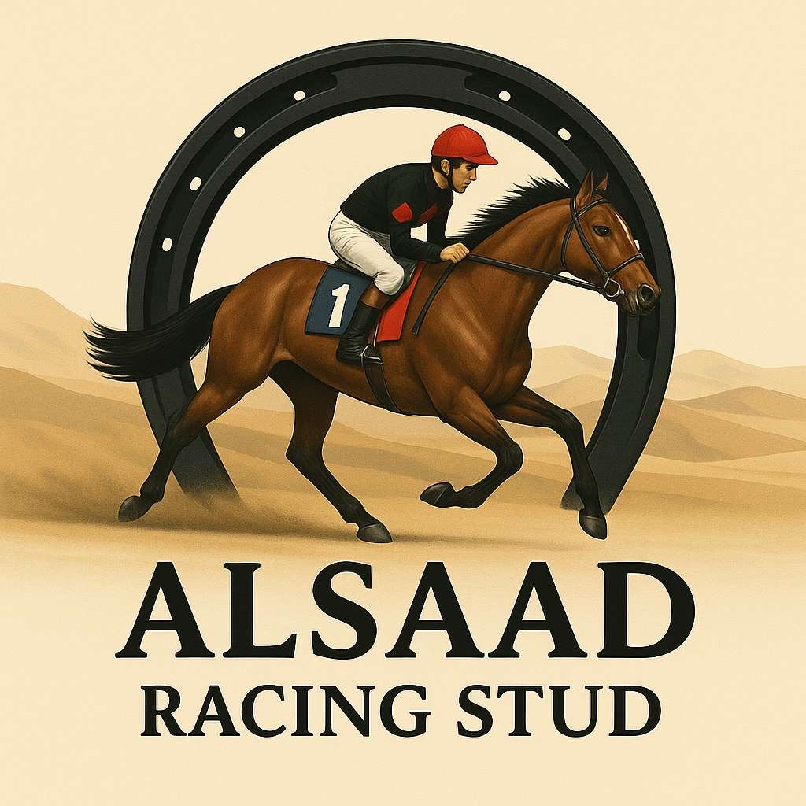
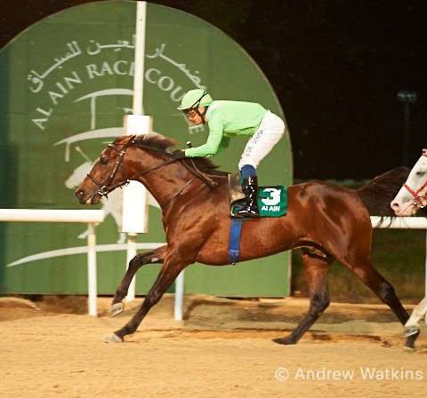
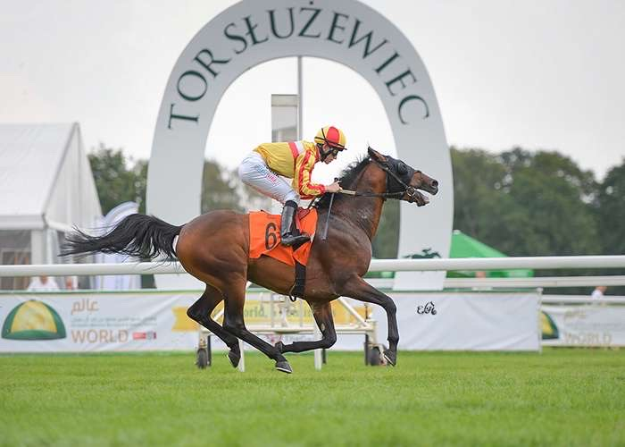

<!DOCTYPE html>
<html lang="ar" dir="rtl">
<head>
    <meta charset="UTF-8">
    <title>اسطبل الساد - Al Saad Racing Stud</title>
    
</head>
<body>
    <header>
        
        <h1>اسطبل الساد – Al Saad Racing Stud</h1>
    </header>
    

        اسطبل الساد هو أحد أقدم وأميز اسطبلات مدينة العين لتدريب وتربية الخيل العربية الأصيلة.
        نمتلك خيولاً ذات جودة عالية ونتخصص في سباقات السرعة والرعاية الدقيقة للمهور والمهرات مثل HQ Mayar وHQ Jamrah.
    

    

        
        
    

    <footer>
        للتواصل: 050-xxxxxxx | الموقع: العين، الإمارات العربية المتحدة 
        <a href="https://maps.google.com" target="_blank">عرض الموقع على الخريطة</a>
    </footer>
</body>
</html>
